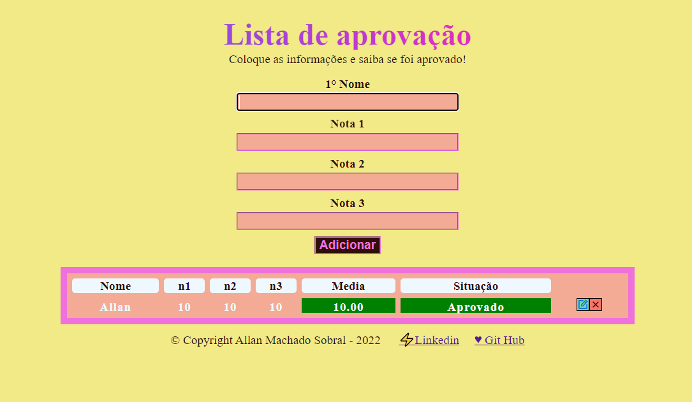

<h1>Lista de Aprovação - CRUD simples</h1>

<h2>Status: Concluído</h2>

Data de conclusão: 31/01/2023

<h2>Descrição</h2>

Projeto que demonstra as operações básicas de CRUD: criar, ler, atualizar e deletar!

    

<h2>Funcionalidades</h2>
<ul>
	<li>Usuário deve informar: 1° nome; e notas 1, 2 e 3</li>
	<li>Ao adicionar as informações, estas são calculadas e inseridas na tabela</li>
	<li>O próiprio sistema detecta a média das notas, e indica a aprovação, ou não.</li>
    <li>Validações: não podem ter campos em branco, e as notas devem ser entre 0 e 10, apenas!
</ul>

<h2>Tecnologias utilizadas</h2>
<ul>
	<li>Html5</li>
	<li>CSS</li>
	<li>JavaScript</li>
    <li>VsCode</li>
</ul>

<h3>Espero que goste, até mais!</h3>
